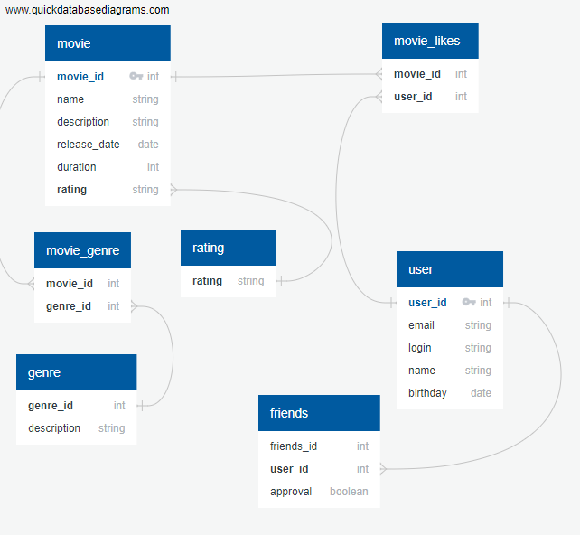

## java-filmorate
Бэкенд приложение **Filmorate** - площадка для общения и взаимодействия пользователей. У пользователей есть возможность заводить друзей, оставлять отзывы и рекомендовать фильмы друг другу. Чтобы пользователи ориентировались в том, что происходит на платформе, есть лента событий. Плюс реализован поиск — в приложении можно легко находить фильмы по ключевому слову из названия или описания.

Программа может принимать, обновлять и возвращать пользователей и фильмы, а также позволяет пользователям добавлять друг друга в друзья, получать список общих друзей и лайкать фильмы.

### REST API приложения.

* PUT /users/{id}/friends/{friendId} — добавление в друзья.
* DELETE /users/{id}/friends/{friendId} — удаление из друзей.
* GET /users/{id}/friends — возвращаем список пользователей, являющихся его друзьями.
* GET /users/{id}/friends/common/{otherId} — список друзей, общих с другим пользователем.

* PUT /films/{id}/like/{userId} — пользователь ставит лайк фильму.
* DELETE /films/{id}/like/{userId} — пользователь удаляет лайк.
* GET /films/popular?count={count} — возвращает список из первых count фильмов по количеству лайков. Если значение параметра count не задано, вернутся первые 10.

* GET /genres - получения списка всех жанров фильмов.
* GET /genres/{id} - получение жанров по идентификатору.

* GET /mpa - список рейтинга фильмов
* GET /mpa/{id} - рейтинг по идентификатору

### Структура хранения данных.

